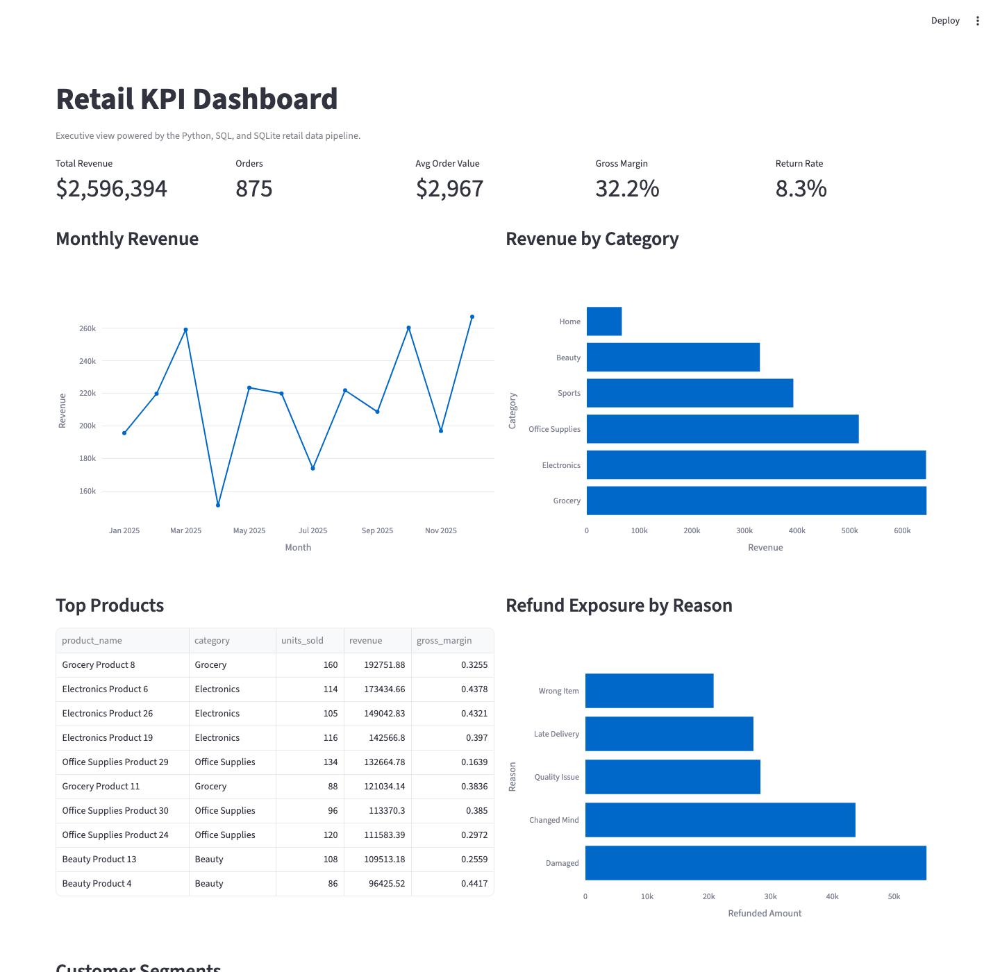

# Retail Data Pipeline and KPI Dashboard

Portfolio BI/Data Engineering project that turns messy retail sales exports into clean SQL tables, KPI datasets, and dashboard-ready files for executive reporting.

## Business Case

Retail managers often receive disconnected CSV exports from customer, product, order, and returns systems. These files usually contain inconsistent dates, duplicate records, invalid quantities, missing fields, and category formatting issues. This project builds a repeatable analytics pipeline that cleans those exports and produces reliable KPIs for sales, product, customer, and returns performance.

## What This Project Demonstrates

- Synthetic retail data generation with realistic data quality issues
- Python/pandas cleaning and business-rule validation
- SQLite data warehouse tables for customers, products, orders, and returns
- SQL KPI outputs for executive reporting
- Tableau-ready exports for dashboard building
- Tests for cleaning logic, revenue calculations, table creation, and KPI consistency
- Data quality summary showing raw rows, cleaned rows, validation issues, and clean rates
- Business insights and recommendations based on exported KPI data

## Architecture

```text
Synthetic raw CSVs
  -> Python CLI pipeline
  -> cleaning + validation
  -> SQLite warehouse
  -> SQL KPI queries
  -> Tableau-ready CSV exports
  -> Executive dashboard
```

## Dashboard Preview



## KPIs

- Total revenue
- Monthly revenue growth
- Average order value
- Gross profit and gross margin
- Revenue by category
- Top products
- Top customers
- Repeat customer flag
- Return/refund rate

## Tech Stack

- Python
- pandas
- SQL
- SQLite
- Tableau first
- Power BI later
- pytest

## Setup

```bash
python3 -m venv .venv
source .venv/bin/activate
pip install -e ".[dev]"
```

## Usage

Generate synthetic raw data:

```bash
retail-kpi generate-data
```

Run the full pipeline:

```bash
retail-kpi run-pipeline
```

Re-export KPIs from the current SQLite database:

```bash
retail-kpi run-kpis
```

Open the optional Streamlit dashboard:

```bash
streamlit run app/streamlit_dashboard.py
```

Run tests:

```bash
pytest
```

## Outputs

- SQLite database: `data/processed/kpi_dashboard.sqlite`
- Cleaned CSVs: `data/processed/`
- Tableau-ready exports: `data/processed/dashboard_exports/`
- Data quality report: `docs/data_quality_report.md`
- Business insights: `docs/insights.md`
- Dashboard assets: `dashboard/`
- Optional Streamlit dashboard: `app/streamlit_dashboard.py`

## Sample KPI Output

Executive overview from the generated dataset:

| total_revenue | total_orders | total_customers | average_order_value | gross_profit | gross_margin | refunded_amount | return_rate |
| ---: | ---: | ---: | ---: | ---: | ---: | ---: | ---: |
| 2,596,393.60 | 875 | 120 | 2,967.31 | 836,354.52 | 32.21% | 175,293.94 | 8.34% |

Top product categories by revenue:

| category | revenue |
| --- | ---: |
| Grocery | 645,930.73 |
| Electronics | 644,942.45 |
| Office Supplies | 517,154.04 |

Data quality summary:

| table_name | raw_rows | clean_rows | validation_issues | clean_rate |
| --- | ---: | ---: | ---: | ---: |
| customers | 121 | 120 | 0 | 99.17% |
| products | 30 | 30 | 0 | 100.00% |
| orders | 902 | 875 | 27 | 97.01% |
| returns | 73 | 73 | 0 | 100.00% |

## Dashboard Plan

Version 1 uses Tableau, with Streamlit included as a quick local preview. The dashboard should contain:

- Executive Overview
- Sales Trends
- Product Performance
- Customer Analysis
- Returns and Quality

Power BI will be added later as a second dashboard version.

## CV Bullets

- Built a retail data pipeline that generates messy business exports, cleans and validates raw sales data, loads SQLite tables, and exports Tableau-ready KPI datasets.
- Implemented revenue, gross margin, monthly growth, product performance, customer analysis, and return-rate reporting with Python, pandas, SQL, and automated tests.
- Created a recruiter-ready BI/Data Engineering case study showing how raw business data becomes executive dashboard insights.
