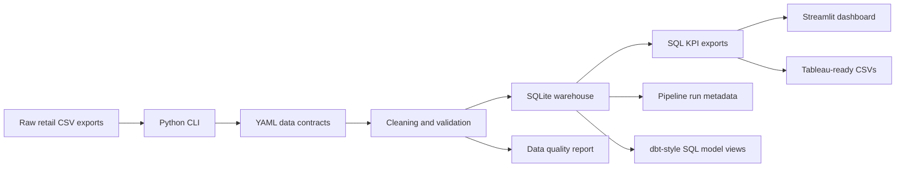
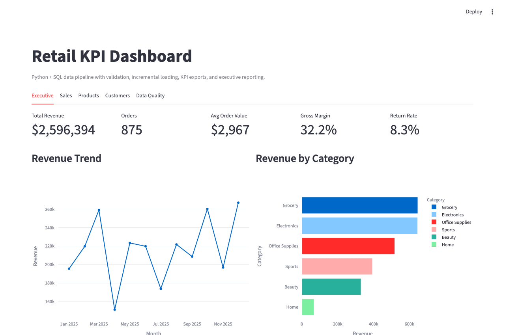

# Retail Data Pipeline and KPI Dashboard

[](https://github.com/AhmedYasserShalaby/data-pipeline-kpi-dashboard/actions/workflows/tests.yml)
[](https://github.com/AhmedYasserShalaby/data-pipeline-kpi-dashboard/actions/workflows/secret-scan.yml)

Portfolio Data Engineering / BI project that turns messy retail exports into validated SQLite warehouse tables, KPI datasets, run summaries, and a recruiter-ready Streamlit dashboard.

## Recruiter Quick Scan

This repo is meant to prove junior data engineering habits:

- clear business problem
- raw-to-clean pipeline
- explicit data contracts
- full and incremental load modes
- rejected-row reporting
- SQL KPI exports
- dbt-style staging/intermediate/mart SQL model views
- optional Airflow DAG for orchestration proof
- root-cause quality diagnosis and remediation backlog
- data lineage documentation
- dashboard-ready outputs
- tests, linting, Docker, CI, and secret scanning

Start here: [Recruiter walkthrough](docs/recruiter_walkthrough.md).

## Live Demo

Streamlit Cloud URL: https://ahmed-retail-kpi-dashboard.streamlit.app/

The dashboard is demo-safe: if ignored KPI exports are missing, it generates synthetic data, runs the pipeline, verifies outputs, and then loads the dashboard.

## Business Case

Retail managers receive disconnected CSV exports from customer, product, order, and returns systems. The files contain duplicate records, inconsistent dates, invalid quantities, missing dimension links, and inconsistent formatting. This project builds a repeatable analytics pipeline that cleans those exports and produces reliable KPIs for revenue, margin, product, customer, returns, and data quality reporting.

## What This Project Demonstrates

- Python CLI pipeline for raw CSV ingestion, cleaning, validation, loading, and KPI export
- YAML data contracts for required columns, ID formats, ranges, dates, allowed values, duplicate keys, and foreign keys
- Full and incremental SQLite loading with idempotent reruns
- SQLite warehouse tables for dimensions, fact-style tables, and pipeline run metadata
- SQL KPI exports for executive reporting
- Lightweight dbt-style SQL model layer under `models/`
- Optional Airflow DAG showing scheduled validation, loading, modeling, and export flow
- Quality diagnosis report that turns validation issues into root-cause and remediation actions
- Lineage documentation for raw sources, trusted warehouse tables, model layers, and dashboards
- Pipeline health checks for required exports, quality score thresholds, and KPI/database consistency
- Streamlit dashboard with executive, sales, product, customer, and data-quality views
- CI with Ruff linting, Ruff format check, pytest coverage, smoke tests, export integrity checks, and secret scanning
- Docker and Docker Compose for reproducible local runs

## Architecture



See [architecture docs](docs/architecture.md) for the warehouse ERD and design notes.

## Dashboard Preview




## Tech Stack

- Python, pandas, SQL, SQLite
- Streamlit, Plotly
- YAML data contracts
- pytest, pytest-cov, Ruff, GitHub Actions
- Docker, Docker Compose
- Tableau-ready CSV exports

## Local Run

```bash
python3 -m venv .venv
source .venv/bin/activate
pip install -e ".[dev]"
retail-kpi generate-data
retail-kpi run-pipeline --mode full
streamlit run app/streamlit_dashboard.py
```

Incremental run:

```bash
retail-kpi run-pipeline --mode incremental
```

Validate raw data contracts:

```bash
retail-kpi validate-contracts
```

## Docker Run

Dashboard:

```bash
docker compose up dashboard
```

Pipeline:

```bash
docker compose run --rm pipeline retail-kpi run-pipeline --mode full
```

## Testing

```bash
ruff check .
ruff format --check .
pytest --cov=src/pipeline --cov-report=term-missing
retail-kpi generate-data
retail-kpi run-pipeline --mode full
retail-kpi run-pipeline --mode incremental
retail-kpi run-kpis
retail-kpi run-models
retail-kpi diagnose-quality
retail-kpi export-lineage
retail-kpi validate-contracts
```

Shortcut commands:

```bash
make setup
make test
make coverage
make lint
make format-check
make smoke
make dashboard
```

## Outputs

- SQLite database: `data/processed/kpi_dashboard.sqlite`
- Cleaned CSVs: `data/processed/`
- Dashboard exports: `data/processed/dashboard_exports/`
- Data quality issues: `data/processed/dashboard_exports/data_quality_issues.csv`
- Data quality summary: `data/processed/dashboard_exports/data_quality_summary.csv`
- Pipeline run summary: `data/processed/dashboard_exports/pipeline_run_summary.csv`
- Data quality report: `docs/data_quality_report.md`
- Pipeline run report: `docs/run_summary.md`
- Business insights: `docs/insights.md`
- Streamlit dashboard: `app/streamlit_dashboard.py`

Generated raw/processed files are ignored so the repository stays clean.

## Sample KPI Output

Executive overview from the generated dataset:

| total_revenue | total_orders | total_customers | average_order_value | gross_profit | gross_margin | refunded_amount | return_rate |
| ---: | ---: | ---: | ---: | ---: | ---: | ---: | ---: |
| 2,596,393.60 | 875 | 120 | 2,967.31 | 836,354.52 | 32.21% | 175,293.94 | 8.34% |

Data quality summary:

| table_name | raw_rows | clean_rows | rejected_rows | validation_issues | clean_rate | quality_score |
| --- | ---: | ---: | ---: | ---: | ---: | ---: |
| customers | 121 | 120 | 1 | 1 | 99.17% | 99.17% |
| products | 30 | 30 | 0 | 0 | 100.00% | 100.00% |
| orders | 902 | 875 | 27 | 52 | 97.01% | 94.24% |
| returns | 75 | 73 | 2 | 2 | 97.33% | 97.33% |

Latest full run:

| rows_read | rows_cleaned | rows_rejected | validation_issues | loaded_rows |
| ---: | ---: | ---: | ---: | ---: |
| 1,128 | 1,098 | 30 | 55 | 1,098 |

## Docs

- [Architecture](docs/architecture.md)
- [Analytics models](docs/analytics_models.md)
- [Orchestration example](docs/orchestration.md)
- [Data lineage](docs/lineage.md)
- [KPI definitions](docs/kpi_definitions.md)
- [Data contracts](docs/data_contracts.md)
- [Data quality report](docs/data_quality_report.md)
- [Quality diagnosis](docs/quality_diagnosis.md)
- [Run summary](docs/run_summary.md)
- [Deployment guide](docs/deployment.md)
- [Interview guide](docs/interview_guide.md)
- [Recruiter walkthrough](docs/recruiter_walkthrough.md)
- [Production upgrade plan](docs/production_upgrade_plan.md)

## Interview Talking Points

- This is an ETL/data-quality project first, dashboard second.
- Data contracts make expected schema and business rules explicit.
- Incremental loading is idempotent and prevents duplicate KPI totals.
- The `models/` layer shows staging, intermediate, and mart SQL organization.
- The optional Airflow DAG shows how the pipeline could be scheduled.
- The quality diagnosis report explains root cause, severity, and remediation, not just row counts.
- Run summaries and quality scores explain whether data can be trusted.
- SQLite was chosen for portability; the model can move to PostgreSQL later.

## CV Bullets

- Built a Python and SQL retail ETL pipeline with YAML data contracts, rejected-row reporting, SQLite warehouse tables, KPI exports, and Streamlit executive dashboard.
- Added full and incremental load modes with idempotent reruns, pipeline run metadata, row-count observability, data quality scoring, and GitHub Actions CI.
- Implemented revenue, gross margin, monthly growth, product performance, customer analysis, return-rate, and data-quality reporting with pandas, SQL, pytest, Ruff, and Docker.
