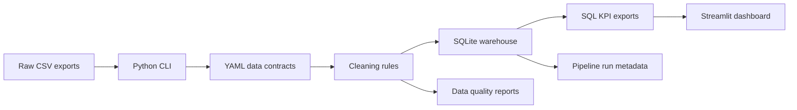
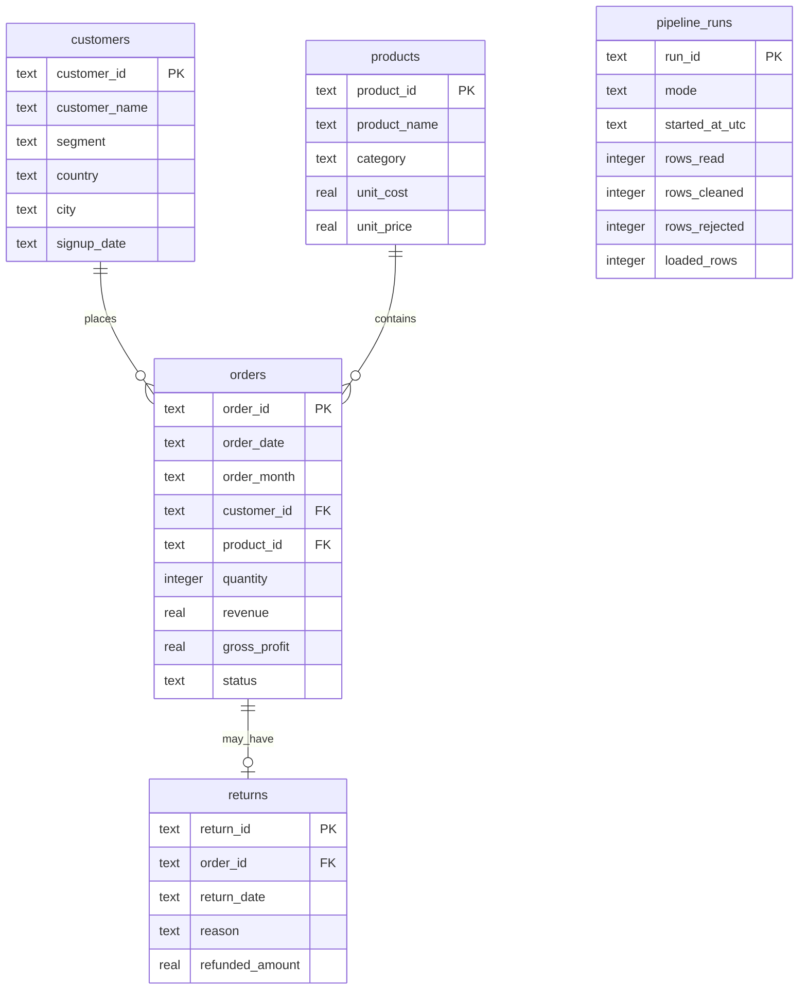

# Architecture

This project models a small retail analytics warehouse and reporting pipeline.

## Flow

## Warehouse Model

## Design Choices

- `customers` and `products` act as dimensions.
- `orders` and `returns` act as fact-style operational tables.
- `pipeline_runs` stores operational metadata for observability.
- SQLite keeps the project easy to run locally and on a public demo.
- Full refresh mode rebuilds warehouse tables.
- Incremental mode inserts only unseen primary keys and keeps reruns idempotent.
- KPI exports are CSV files so Streamlit, Tableau, and Power BI can reuse the same outputs.
