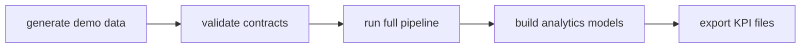

# Orchestration Example

This repo includes an optional Airflow DAG at:

`orchestration/airflow/retail_kpi_dag.py`

It is not required for the default local run. The goal is to show how the project would be scheduled and monitored in a real data team.

## DAG Flow



## What It Demonstrates

- Task dependencies.
- Retry policy.
- Daily schedule.
- Separation between validation, loading, modeling, and KPI export.
- A production-style path without making Airflow a required dependency.

## Local Default

Use the Makefile when Airflow is not installed:

```bash
make smoke
```

That runs the same core sequence through the project CLI.
